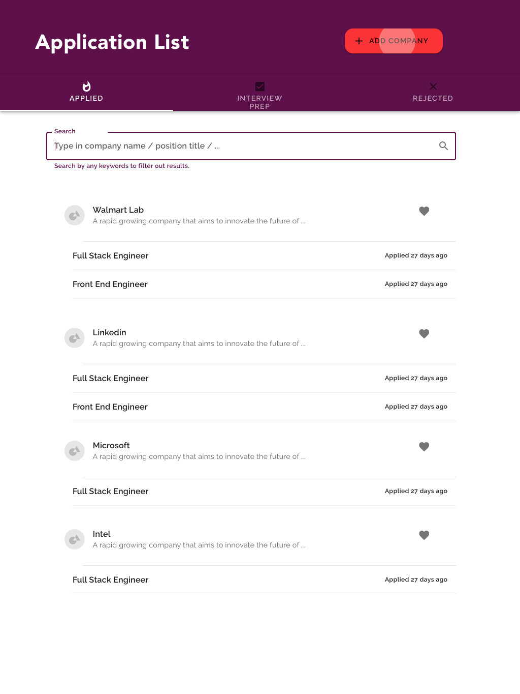
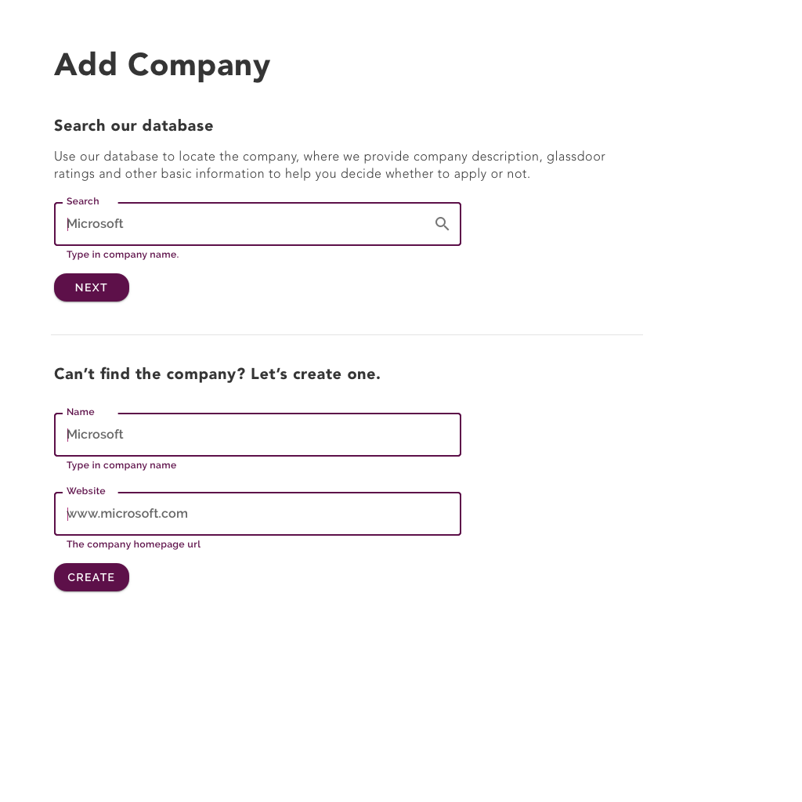
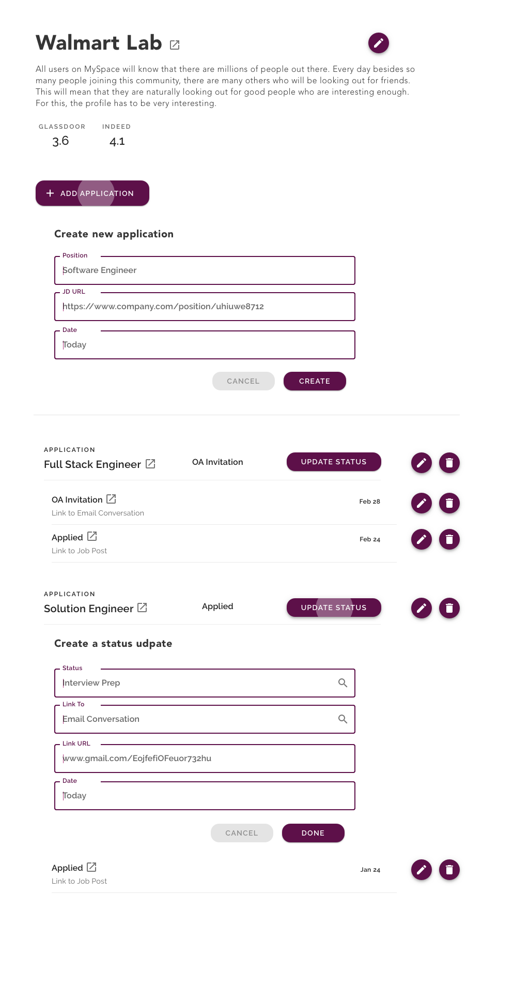

# appl-tracky
An Application Tracking System to help job finders ease their out-of-control spreadsheet use tracking every job application record.

## Roadmap

Back End

- Build REST API
    - [ ] Test out database access. If one table can work, all table can work.
        - [x] Create the `Company` table, and create required related tables.
        - [x] Setup relationships and fields. No need to fill in arguments yet.
            - **Change `OneToMany` to `ForeignKey`**: `OneToMany` relationship [should be implemented by `ForiegnKey`](https://stackoverflow.com/a/6929269/9814131), which is `ManyToOne`. So put the foreign key at the other side, then you can use reverse lookup to acheive `OneToMany`.
            - In a model, if you have two fields using foreign key or one to one to point to external model, you have to specify argument `related_name` to avoid [reverse lookup crash](https://stackoverflow.com/questions/26955319/django-reverse-accessor-clashes/26955340).
        - Complete arguments for models:
            - [x] nullability. ([`blank` vs `null` explained](https://stackoverflow.com/questions/8609192/differentiate-null-true-blank-true-in-django)) Does it make sense to not have a value in database for that field?
                - [x] Exceptions: If `CharField` or `TextField`, no need for `null=`. Is forced to empty string if not specifying value.
                - Exception: `ManyToMany` cannot set `null=`, [no effect](https://stackoverflow.com/questions/18243039/migrating-manytomanyfield-to-null-true-blank-true-isnt-recognized).
            - [x] blank? required or not upon user input
            - [x] default?
                - [x] uuid - use version 4. also set editable to `False`.
                - [x] Django [Meta class](https://docs.djangoproject.com/en/2.1/topics/db/models/#meta-inheritance) for model inheritance, useful for setting default behaviors.
            - [x] max_length: only on `CharField`
            - [x] `on_delete` for all relational fields, including `OneToOne`, `ForeignKey` and `ManyToMany`.
                - `on_delete=models.SET_NULL` often pairs with `null=True`; on the other hand `on_delete=models.CASCADE, null=False` pairs together.
            - [x] other attributes for special fields
            - Refine models:
                - [x] setup `def __str__(self)`.
                - [x] specify [`class Meta`](https://docs.djangoproject.com/en/2.1/ref/models/options/#get-latest-by) if necessary.
                - [x] Any [optional arguments](https://docs.djangoproject.com/en/2.1/ref/models/fields/#help-text) for fields?
        - [x] Maybe to better add all table at once before migration
- [ ] 🔥 🔥 🔥 Run `runserver`, resolve any issues reported.
- [ ] Build custom user model, follow iriversland public's method.
- [ ] Migration (or rebuild database if already built schema) apply to database. Test if it works fine?
- [ ] User authentication using social media service. How to integrate in Django and JWT?
- [ ] Apply Django REST Framework.
- [ ] Setup user permission control. Watch out JWT and session maintenance.

Front End

- [ ] Material UI: which library to use?
- [ ] Scaffold React
- [ ] Consider using Redux.

DevOps

- [ ] Set `ALLOWED_HOSTS` to secure in Django.
- [ ] Can try container level health check, try `docker inspect ...` following the amazon trouble shopting article, try that in container's health check command.

## System Overview & Documentation

### Data model

### Front End UI

Home page outlining all applications.

Add a company to start registering applications for a company.

Add updates to applications.

### Reflection for Frontend UI: 
Is this easier to use than spreadsheet? The UI should make the registering process as quick as possible. If we split into too many steps and pages, it'll dramatically slow down the process.
But sure, we're still not sure what is the best and what are the needs. We can always iterate the layout or process at a later point.

## Other Dev Notes

Backend

- `on_delete` [possible values](https://docs.djangoproject.com/en/2.1/ref/models/fields/).
- [Django Countries](https://github.com/SmileyChris/django-countries), also check out the country object.
- [Retrieve reverse foreign key lookup; retrieve latest / earliest.](https://stackoverflow.com/questions/51199214/django-filter-by-latest-with-reverse-foreign-key)
    - Also see [Django model `class Meta` options](https://docs.djangoproject.com/en/2.1/ref/models/options/#get-latest-by).

Overall

1. How to integrate React w/ Django? After we figure that out, we can start scaffolding our project.
    - [This tutorial](https://www.valentinog.com/blog/tutorial-api-django-rest-react/#Django_REST_with_React_Django_and_React_together) to set React's built src file under Django (or even the react project folder under django).
        - There're some problems, like servig static files. You can bundle frontend into a html and js file. But You still have to load that js as a static resources, and you have to place that `` in, which is not auto-generated by `npm build`.
    - **Or use saperate repo for django and react.** <-- Seems like a mich cleaner way to do this.
1. Scaffold Django project.
1. Deploy production backend. Consider using Docker, and deploy on ECR, using our existing ECS cluster.
    - [Update aws container agent](https://docs.aws.amazon.com/AmazonECS/latest/developerguide/agent-update-ecs-ami.html).
        - [SSH into a container](https://docs.aws.amazon.com/AmazonECS/latest/developerguide/instance-connect.html)
        - [How to get a provate key pair](https://docs.aws.amazon.com/AmazonECS/latest/developerguide/get-set-up-for-amazon-ecs.html#create-a-key-pair)
        - The public DNS is `ec2-107-22-157-134.compute-1.amazonaws.com`, and public IP is `107.22.157.134`. Now ssh to the container by `ssh -i path/to/pem ec2-user@107.22.157.134`
        - According to [this aws doc](https://docs.aws.amazon.com/AmazonECS/latest/developerguide/instance-connect.html), "If you did not specify a key pair when you launched your instance, there is no way to connect to the instance."
        - What we will do: **create a new series of instance, task, service for this project (tracky) using some automation tool**. Then, use the same tool to re-create the bb backend container and related service/task. We will deal with CI/CD later.
            - **First we need to dockerize Django**. Docker for Django is quite complicate, as we have to setup Nginx, gunicorn, and basically a linux environment. [Follow this post](https://medium.com/@rohitkhatana/deploying-django-app-on-aws-ecs-using-docker-gunicorn-nginx-c90834f76e21). [Found this newer article, will use this to dockerize](https://testdriven.io/blog/dockerizing-django-with-postgres-gunicorn-and-nginx/).
                - We are skipping the Serving Media File part. Note that both Serving Static/Media File in [the article](https://testdriven.io/blog/dockerizing-django-with-postgres-gunicorn-and-nginx/) are all exposed to public access. This is explained in [this SO post](https://stackoverflow.com/a/28167298/9814131), where Nginx doesn't have access to user authentication in Django so have to do special settings for both Django and Nginx. Or, if you really want to host private files on in the container, [try this answer](https://stackoverflow.com/a/28167162/9814131), where it refrain from using MEDIA_URL and STATIC_URL, instead, it uses a Django view as guard and serve the file by streaming it back to the client. (So the client "download" it). This is different from a S3 approach where Django only handles text-based URLs and provide that URL to client directly. The responsibility for restricting private file is now lay to S3.

            - Next: figure out how to use Terraform to create those resources.
                - Consider creating new ECS in east-2 so you can reuse stuff like https certificate, etc.
                - Create container (ECR) --> task definition --> cluster --> service in terraform
                    - How to create ECR in terraform: Make sure where the docker image come from, and interpolate into container_definition json
                        - Do we need both resource and data source for ecr? Because for Task definition he did that! But he later use data.task_definition so he did use it. ==> we'll just use resource for ECR.
                            - TODO: The image tag thing is still remain unclear...
                    - Task definition: are we all set?
                    - Next: service, ...
                - We decide to try `ecs-cli` instead of `terraform`.
                    - `brew install amazon-ecs-cli`
                    - Create a profile `ecs-cli configure profile --profile-name ApplTrackyProfile --access-key $AWS_ACCESS_KEY_ID --secret-key $AWS_SECRET_ACCESS_KEY`
                        - verify `cat ~/.ecs/credentials`
                    - Create a config for cluster `ecs-cli configure --cluster ApplTrackyCluster --region $AWS_REGION --default-launch-type EC2 --config-name ApplTrackyConfig`
                        - verify `cat ~/.ecs/config`
                    - Create cluster `ecs-cli up --debug --keypair shaungc-ecs --capability-iam --launch-type EC2 --size 1 --instance-type t2.micro --azs us-east-2a,us-east-2b --image-id ami-04b61a4d3b11cc8ea --force --cluster-config ApplTrackyConfig --cluster ApplTrackyCluster`
                        - **Important**: grant IAM user/role with `ECSFullAccess` and `IAMFullAccess` (and also `EC2FullAccess`).
                        - Warning: [this post](https://github.com/aws/amazon-ecs-cli/issues/318) talks about using `AWS EBS` as storage, instead of storing data on the cluster.
                        - Make sure you use the key name on EC2 when specifying the key pair, [not the local path](https://stackoverflow.com/questions/48471739/ecs-cli-key-pair-error-when-calling-up).
                        - [Full list of available parameters](https://docs.aws.amazon.com/AmazonECS/latest/developerguide/cmd-ecs-cli-up.html).
                        - Options that we didn't specify: `--security-group`, `--port`, `--vpc`, `--subnets` ...
                    - Create by docker compose
                        - [Setup environment secrets](https://medium.com/@felipgomesilva/using-secrets-in-aws-ecs-dc43c37ce4a1).
                        - Manually create ECR
                        - Manually create two repos on ECR, named `appl-tracky/nginx` and `appl-tracky/django`, this will be a one-time action.
                        - Put the base ECR url as evironment variable `AWS_ECR_URL` in `.env`.
                        - Create `image:` entry in `docker-compose.yml`, [like this SO post](https://stackoverflow.com/a/51663052/9814131). Also add a `link:` in `ecs-params.yml`, according to [this post](https://docker-curriculum.com/), maybe it can replace the unsupported `depends_on:`.
                            - Make sure to specify `assign_public_ip: ENABLED` in `ecs-params.yml`, or [your ecs compose up might fail](https://github.com/aws/amazon-ecs-agent/issues/1654).
                        - Dealing with Volume: pgrepare two versions of `docker-compose.yml`. [We cannot mount source directory](https://medium.com/@peatiscoding/docker-compose-ecs-91b033c8fdb6) using the dot in `./django/:`. So duplicate another YAML as `docker-compose-ecs.yml`, remove the whole line of `./django/:/usr/src/django/`. Go into `Dockerfile` and copy the whole project to container's directory: `ADD . /usr/src/django/`.
                        - Do pip install `awscli` (use django's venv) and login to ECR by `$(aws ecr get-login --no-include-email --region us-east-2)`
                        - `docker-compose build`, it'll build all images and set the `:latest` tag for you.
                            - You can test it to run by `docker-compose up -d`.
                        - **Make sure you run in project root directory:** `docker-compose push` 
                        - Compose: `ecs-cli compose --debug --file docker-compose-ecs.yml --project-name ApplTracky --ecs-params ecs-params.yml --cluster-config ApplTrackyConfig --cluster ApplTrackyCluster  service up`
                            - check status `ecs-cli ps`
                        - Manually creating task definitions. [Mount host volume correctly](https://stackoverflow.com/questions/36904908/amazon-ecs-host-directory-access).
                - Push the docker image to ECR by AWS CodeBuild, test out the production site.
                - Do we have to setup a Load Balancer?
    - Steps
        1. Create AWS resources by automation tool, perhaps terraform.
            - Try [terraform](https://www.terraform.io/docs/providers/aws/index.html).
        1. Develop a CI/CD process. You can just use AWS CodePipeline.
    - You want to checkout load balancer, or [follow steps in this SO answer to wire up subdomain by Route 53](https://stackoverflow.com/questions/27336657/does-it-make-sense-to-have-an-amazon-elastic-load-balancer-with-just-one-ec2-ins).
    

# Reference

- [This repo](https://github.com/rivernews/appl-tracky-api)
- [The frontend react repo](https://github.com/rivernews/appl-tracky)
- [Diff between Nignx and gunicorn]()
- DB in Docker
    - MySQL
        - [HackerNews: Using MySQL in Django Docker Project](https://hackernoon.com/8-tips-for-containerizing-django-apps-5340647632a4)
    - Need to reset database volume in docker image/container? [See the argument (Github)](https://github.com/docker/compose/issues/2127), or [this SO](https://stackoverflow.com/questions/39776713/docker-compose-reinitializing-mysql-db-every-time).
    - Postgres: resetting things. [Default user and password are automatically set.](https://www.liquidweb.com/kb/what-is-the-default-password-for-postgresql/): default user is `postgres`, default password is `postgres`, default db name is `postgres`, default host url is `db`. If you want to change this, [follow this SO ](https://stackoverflow.com/q/46669759/9814131) by adding `POSTGRES_DB`, ..., etc. It'll automatically create the default database, username, ... by what you specify.
        - Connect to Postgres server by `docker-compose exec db psql db-name username`
- Docker commands
    - Danger: these two lines will wipe out everything in Docker on your local computer:
        - [Stop all containers](https://linuxize.com/post/how-to-remove-docker-images-containers-volumes-and-networks/): `docker container stop $(docker container ls -aq)`
        - Remove everything unused, including volumes: `docker system prune --volumes`.
    - List all volumes. `docker volume ls`.
    - Delete a named volume: `docker volume rm <volume name like appl-tracky-api_postgres_data>`
    - Build and turn on all: `docker-compose up -d --build`.
    - Turn off and delete all containers (but not named volumes): `docker-compose down`
    - Run django commands: `docker-compose exec web python manage.py ...`
    - Troubleshooting
        - Bad network while building docker image and can't pull down docker image resources? Try to restart docker service and rebuild again.
        - [port and expose](https://stackoverflow.com/questions/35548843/does-ports-on-docker-compose-yml-have-the-same-effect-as-expose-on-dockerfile)
- `ecs-cli` [commands](https://docs.aws.amazon.com/AmazonECS/latest/developerguide/ECS_CLI_reference.html).
- [Setup subdomain for different app](http://altitudelabs.com/blog/how-to-set-up-app-subdomain-route-53/)